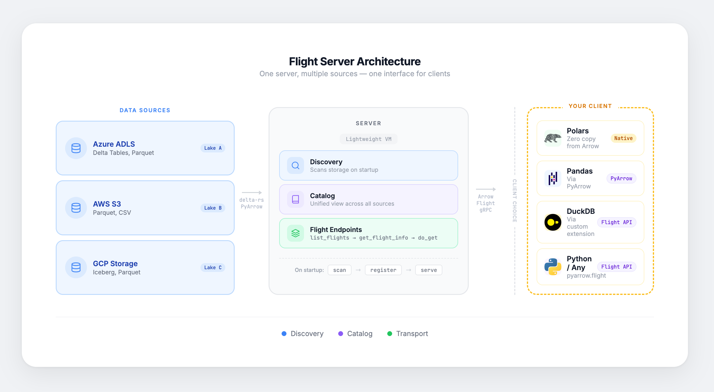

# Apache Arrow Flight Server Demo

Two read-only Arrow Flight servers for streaming Delta Lake tables from Azure Blob Storage.

| Server | Protocol | Port | Client |
|--------|----------|------|--------|
| `vanilla-flight-server` | Standard Arrow Flight | 8815 | Any Arrow Flight client |
| `airport-flight-server` | Airport (DuckDB extension) | 8815 | DuckDB `ATTACH` |

> This project is a simplified version of [azure-delta-server](https://github.com/patricktinsley/azure-delta-server), which covers a more advanced implementation with server-side query execution and benchmarks.

## Architecture



## Prerequisites

- Python 3.12+
- Azure Storage Account
- Delta tables in Azure Blob Storage

## Installation

```bash
uv sync
```

## Configuration

Set these environment variables (or use `.envrc` with direnv):

```bash
export AZURE_CONNECTION_STRING="DefaultEndpointsProtocol=https;AccountName=..."
export AZURE_CONTAINER="your-container"
export AZURE_PREFIX="optional/path/prefix"   # optional
```

With [direnv](https://direnv.net/), copy `.envrc.example` to `.envrc`, fill in your values, and run `direnv allow` — variables will load automatically on `cd`.

---

## Server 1: Vanilla Flight Server

A minimal Arrow Flight server. Extends PyArrow's `FlightServerBase` directly — no extra dependencies beyond PyArrow and delta-rs.

Clients use the standard Arrow Flight protocol: `list_flights`, `get_flight_info`, `do_get`.

### Start

```bash
vanilla-flight-server
# Listening on grpc://0.0.0.0:8815
```

```bash
FLIGHT_HOST=0.0.0.0 FLIGHT_PORT=8815 vanilla-flight-server
```

### Query with the Python client

```bash
# List tables
python scripts/vanilla_client_demo.py --server grpc://localhost:8815

# Fetch a table
python scripts/vanilla_client_demo.py --server grpc://localhost:8815 --table prices_external
```

Or use the PyArrow Flight client directly:

```python
import pyarrow.flight as flight
import polars as pl

client = flight.connect("grpc://localhost:8815")

# List tables
for fl in client.list_flights():
    print(fl.descriptor.path[0].decode(), fl.schema)

# Fetch a table
descriptor = flight.FlightDescriptor.for_path("prices_external")
info = client.get_flight_info(descriptor)
table = client.do_get(info.endpoints[0].ticket).read_all()

df = pl.from_arrow(table)                        # zero-copy into Polars
```

---

## Server 2: Airport Flight Server

An Airport-compatible Flight server. DuckDB's [Airport extension](https://github.com/Query-farm/airport) adds catalog discovery, predicate pushdown, and column pruning on top of Arrow Flight.

Clients use DuckDB's `ATTACH` command — the server looks like a regular database catalog.

### Start

```bash
airport-flight-server
# Listening on grpc://0.0.0.0:8815
```

```bash
FLIGHT_HOST=0.0.0.0 FLIGHT_PORT=8815 airport-flight-server
```

### Query with DuckDB

```bash
python scripts/airport_client_demo.py --server grpc://localhost:8815
```

Or directly in DuckDB:

```sql
INSTALL airport FROM community;
LOAD airport;

ATTACH 'grpc://localhost:8815' AS db (TYPE AIRPORT);

SHOW ALL TABLES;

SELECT * FROM db.default.prices_external LIMIT 10;

-- Predicate pushdown: WHERE clause pushed to the server scanner
SELECT COUNT(*) FROM db.default.prices_external WHERE Symbol = 'AAPL';

-- Column pruning: only requested columns read from Parquet
SELECT Symbol, AVG(Close) FROM db.default.prices_external GROUP BY Symbol;
```

### Running as a long-lived process

**tmux** (interactive, easy to attach/detach):
```bash
tmux new -s flight-server
source .envrc && airport-flight-server
# Ctrl+b, d to detach
# tmux attach -t flight-server to reconnect
```

**systemd** (Linux service, survives reboots):
```bash
# Create /etc/systemd/system/airport-flight-server.service
# with EnvironmentFile pointing to your .envrc
systemctl enable --now airport-flight-server
```

---

## Troubleshooting

**`No tables found`** — check `AZURE_CONNECTION_STRING`, `AZURE_CONTAINER`, and that the container has Delta tables (directories containing `_delta_log/`).

**`Deletion vectors error`** — delta-rs does not support deletion vectors. Run `OPTIMIZE` + `VACUUM` on the table in Spark/Databricks first.

**Port already in use** — change the port with `FLIGHT_PORT=8816 airport-flight-server`. On Azure VMs, port 8080 is often taken by Trino (auto-starts on reboot). Use `lsof -i :8815` to check.

**IPv4/IPv6 mismatch on Azure VMs** — if another service binds to IPv4 on the same port, the Flight server may silently bind to IPv6 only. Clients connecting via IPv4 will not reach the Flight server. Stop the conflicting service before starting.
